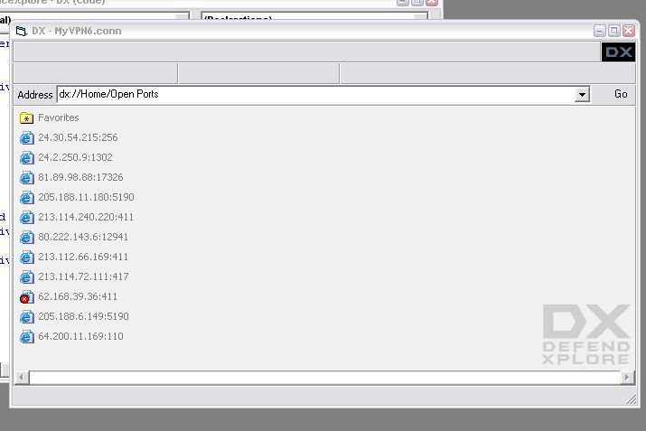



## View all IPs & Ports connected to your computer

### Description

This program will allow you to view all IP addresses connected to your computer, as well as IPs that recently connected and disconnected.
 
### More Info
 

             |
---                |---
**Submitted On**   |2004-02-18 17:57:40
**By**             |[Mark Anthony Entingh](https://github.com/Planet-Source-Code/PSCIndex/blob/master/ByAuthor/mark-anthony-entingh.md)
**Level**          |Advanced
**User Rating**    |4.8 (24 globes from 5 users)
**Compatibility**  |VB 3\.0, VB 4\.0 \(32\-bit\), VB 5\.0, VB 6\.0
**Category**       |[Internet/ HTML](https://github.com/Planet-Source-Code/PSCIndex/blob/master/ByCategory/internet-html__1-34.md)
**World**          |[Visual Basic](https://github.com/Planet-Source-Code/PSCIndex/blob/master/ByWorld/visual-basic.md)
**Archive File**   |[View\_all\_I1710582182004\.zip](https://github.com/Planet-Source-Code/mark-anthony-entingh-view-all-ips-ports-connected-to-your-computer__1-51855/archive/master.zip)

